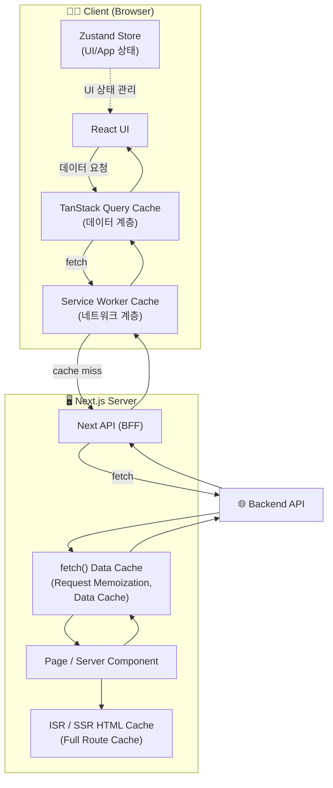
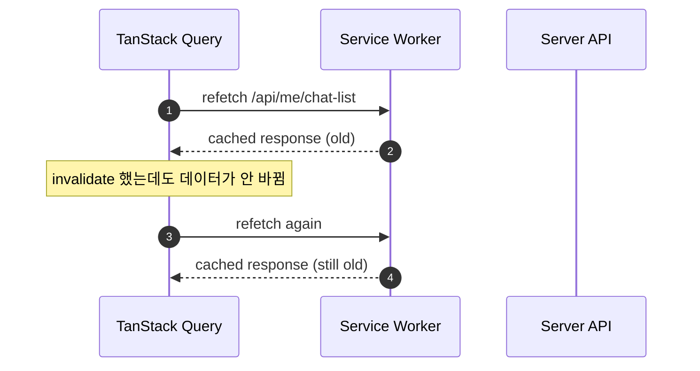
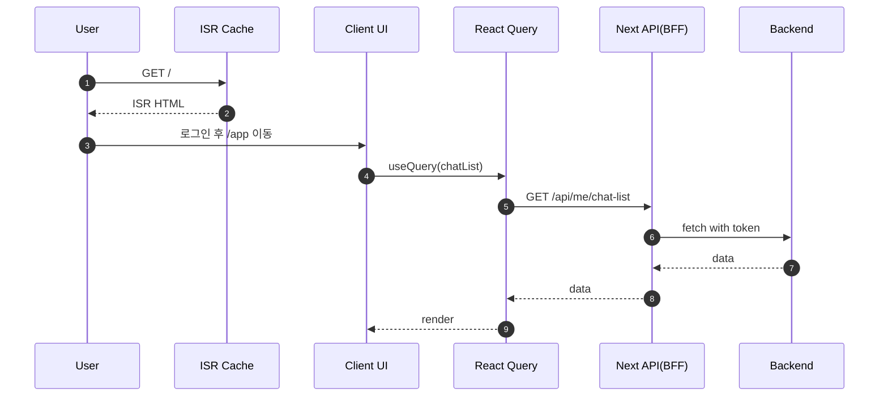

# 📚 Next.js 캐싱, TanStack Query, Service Worker 정리

---
## <mark>Next.js 캐싱, TanStack Query, Service Worker </mark>
Next.js를 공부하다 보니 이런 의문이 자연스럽게 들었다.

Next는 기본적으로 fetch 결과를 캐싱해 주고 ISR을 통해 HTML을 재사용하며, 요청 단위의 메모이제이션까지 제공한다.
이미 서버 쪽에서 이렇게 많은 캐싱을 해주는데 문서를 보다 보면 또 TanStack Query(React Query)를 함께 사용하라고 한다.

여기에 더해 PWA나 오프라인 대응을 위해 Service Worker까지 도입하려고 하면 상황은 더 복잡해진다.
**서버에도 캐시가 있고, 클라이언트에도 캐시가 있고, 네트워크 계층에도 캐시**가 생기는 셈이다.

그러다 보니 자연스럽게 이런 불안이 생긴다.

“캐시가 이렇게 여러 개면, 서로 충돌하지는 않을까?”
“어떤 캐시는 필요한 거고, 어떤 캐시는 과한 걸까?”
“잘못 쓰면 오히려 상태가 꼬이지는 않을까?”

이 글은 바로 그 지점에서 출발한다.
Next.js의 캐싱, TanStack Query, 그리고 Service Worker를 각각의 역할과 계층으로 나누어 이해해보고
왜 이들이 겹치는 것처럼 보이지만 실제로는 다른 문제를 해결하고 있는지 정리해보려 한다.

---
> Next.js 캐시 (Server Cache)

- 서버에서 HTML과 fetch 결과를 캐싱해 렌더링 비용과 초기 응답 속도를 최적화하는 캐시.

> TanStack Query 캐시 (Client Data Cache)

- 클라이언트에서 서버 상태를 캐싱하고, 데이터의 신선도·재요청·무효화를 관리하는 캐시.

> Service Worker 캐시 (Network Cache)

- 브라우저 네트워크 계층에서 요청을 가로채 정적 리소스나 공개 응답을 캐싱하는 캐시.

## 0. 캐싱을 구분하는 핵심 요소: 계층

웹 앱에서 데이터가 이동하는 길은 단순해 보이지만 사실은 층이 있다.

1. 사용자가 페이지를 요청한다 (브라우저)
2. 서버(Next)가 HTML을 만든다 또는 캐시에서 꺼낸다
3. 브라우저가 JS를 실행하고, 필요한 데이터를 API로 추가 요청한다
4. 응답이 오면 UI가 렌더링된다

여기서 캐싱은 여러 지점에서 발생할 수 있다.

* **서버에서 HTML을 캐싱**할 수 있다 (ISR)
* **서버에서 fetch 결과를 캐싱**할 수 있다 (Next Data Cache)
* **브라우저 네트워크 계층에서 캐싱**할 수 있다 (Service Worker)
* **브라우저 메모리에서 캐싱**할 수 있다 (TanStack Query)

이걸 레이어로 그리면 이렇게 된다.



여기서 가장 중요한 결론은 이거다.

> **Next 캐시는 “서버 최적화”**,
> **Service Worker 캐시는 “네트워크 최적화”**,
> **React Query 캐시는 “클라이언트 UX 최적화”**

목적이 다르기 때문에 **대체 관계가 아니라 보완 관계**다.

---

## 1. Server 레이어: Next.js 캐시

### (1) Full Route Cache = ISR HTML 캐시

* 특정 페이지(`/`)의 HTML 결과물을 캐싱한다.
* 많은 사람이 “ISR”이라고 부르는 게 이거다.

**예시**: 랜딩 페이지가 5분마다 바뀌게 하고 싶다면

```ts
// app/page.tsx
export const revalidate = 300;
```

이렇게 하면 `/` 요청이 들어왔을 때, 서버가 매번 HTML을 다시 만드는 게 아니라
**캐시된 HTML을 주다가** 필요할 때만 갱신한다.

**효과**

* SEO 좋음(HTML이 서버에서 생성)
* TTFB 빠름(캐시된 HTML)
* 서버 부담 줄어듦

---

### (2) Data Cache = 서버의 fetch 결과 캐시

Next 서버에서 `fetch()`를 할 때, 그 결과를 캐싱할 수 있다.

```ts
await fetch("https://example.com/api/public", {
  next: { revalidate: 60 },
});
```

이건 HTML이 아니라 **데이터 응답을 서버가 캐시**하는 거다.

**오해 포인트**

* “TanStack Query랑 똑같은 캐시 아닌가요?”
  → 비슷해 보이지만 전혀 다름. 이건 **서버 캐시**고, React Query는 **브라우저 캐시**다.

알겠어. **면접이나 글 중간에 바로 쓰기 좋은 수준**으로,
**Next.js `fetch` 데이터 캐싱 옵션 4개만** 간단히 정리해줄게.

(Next.js App Router 기준)

---

#### Next.js `fetch` 데이터 캐싱 옵션 4가지

#### 1️⃣ `force-cache` (기본값)

> **서버에서 데이터를 캐싱하고, 캐시된 값을 재사용**

```ts
fetch(url, { cache: "force-cache" })
```

* 한 번 가져온 데이터는 서버 캐시에 저장
* 이후 요청에서는 같은 데이터 재사용
* ISR/SSG와 잘 어울림

**용도**

* 공개 데이터
* 거의 변하지 않는 데이터

---

#### 2️⃣ `no-store`

> **캐싱하지 않고, 매 요청마다 새로 fetch**

```ts
fetch(url, { cache: "no-store" })
```

* 서버 캐시 완전 비활성화
* 요청마다 항상 최신 데이터
* 해당 페이지는 dynamic(SSR)으로 처리됨

**용도**

* 로그인 사용자 데이터
* 실시간 데이터
* 개인화 데이터

---

#### 3️⃣ `revalidate: number`

> **일정 시간 동안 캐시를 유지하고, 이후 재검증**

```ts
fetch(url, { next: { revalidate: 60 } })
```

* 60초 동안은 캐시 사용
* 시간이 지나면 백그라운드에서 갱신
* ISR의 핵심 옵션

**용도**

* 주기적으로 바뀌는 공개 데이터
* SEO 대상 콘텐츠

---

#### 4️⃣ `revalidate: 0`

> **사실상 `no-store`와 동일 (즉시 재검증)**

```ts
fetch(url, { next: { revalidate: 0 } })
```

* 캐시를 사용하지 않음
* 항상 최신 데이터
* 페이지는 dynamic 처리

**용도**

* 항상 최신성이 중요한 데이터
* SSR 명시용

---

### (3) Request Memoization = 같은 요청 안에서 중복 fetch 제거

Server Component 렌더링 중에 같은 데이터를 여러 번 요청하면,
Next가 “이번 요청 처리 동안만” 한 번만 호출하도록 최적화한다.

**핵심**

* “요청 1번 처리하는 동안만” 효과 있음
* 사용자가 새로고침하거나 다음 요청 오면 새로 시작

---

### Server 캐시는 언제 쓰면 좋은가?

* **모든 사용자에게 동일한 HTML/데이터**일 때.
* 예: 랜딩/공지/가격/가이드/블로그 글

### 언제 위험한가?

* “유저마다 다른 데이터”를 서버 렌더 단계에서 섞는 순간

예를 들어

```ts
import { cookies } from "next/headers";

export default async function Page() {
  const token = cookies().get("token"); // ← 여기서부터 페이지는 dynamic
  ...
}
```

이 코드가 들어간 순간 이 페이지는 “요청마다 달라지는 HTML”이 될 수 있어.
그래서 ISR이 깨지고 SSR로 바뀐다.

---

## 2. Client 레이어: TanStack Query

질문!!

> **서버가 HTML/데이터를 캐시해주는데 브라우저에서 또 캐시가 필요한 이유는?**

답은 간단하다.

**Next 캐시는 “서버에서 HTML을 만들 때”만 도움이 된다.**
하지만 우리가 사용자 경험에서 힘든 구간은 이런 거다.

* 페이지 이동할 때마다 로딩 스피너가 다시 뜸
* 네트워크가 잠깐 끊기면 UI가 깨짐
* 데이터 업데이트 후 리스트를 다시 갱신해야 함
* “보내기” 누르면 즉시 반영(Optimistic)하고 싶음

이건 “서버 캐시”만으로 해결하기 어렵고
**브라우저에서 데이터 생명주기를 관리하는 도구**가 필요하다. 그게 TanStak Query다.

---

### TanStack Query가 하는 일을 한 문장으로

> “이 데이터는 지금 신선한가? stale이면 언제 다시 가져올까? 실패하면 재시도할까? 업데이트 후 어떤 캐시를 무효화할까?”

---

### TanStack Query 예시: 채팅 리스트

```tsx
"use client";
import { useQuery } from "@tanstack/react-query";

function ChatList() {
  const { data, isLoading, error } = useQuery({
    queryKey: ["chatList"],
    queryFn: () => fetch("/api/me/chat-list").then(r => r.json()),
    staleTime: 10_000, // 10초 동안은 신선하다고 판단
  });

  if (isLoading) return <div>로딩...</div>;
  if (error) return <div>에러!</div>;

  return (
    <ul>
      {data.items.map((c:any) => <li key={c.id}>{c.title}</li>)}
    </ul>
  );
}
```

이제 장점이 생긴다.

* 같은 `["chatList"]`를 쓰는 컴포넌트가 여러 개여도 요청은 한 번
* 페이지 이동 후 돌아와도 캐시가 남아있으면 즉시 렌더링 가능
* stale이면 자동으로 갱신 가능
* mutation 이후 invalidate로 최신화 가능

---

### TanStack Query 예시: 메시지 보내기(optimistic update)

채팅 서비스에서 “전송” 버튼을 누르면, 서버 응답을 기다리지 않고
UI에 먼저 메시지를 붙이는 게 자연스럽다.

React Query는 이 패턴을 지원한다.

(코드는 길어져서 여기서는 개념만)

* 전송 클릭
* 캐시에 메시지 임시 추가(optimistic)
* 서버 성공 → 확정
* 서버 실패 → 롤백

이걸 Next 서버 캐시만으로 하면 설계가 급격히 복잡해진다.

---

## 3. Network 레이어: Service Worker

Service Worker는 “브라우저 앱보다 아래”에 있다.
즉, TanStack Query가 fetch를 호출해도, 그 요청은 먼저 Service Worker를 지나간다.

Service Worker는 이렇게 동작할 수 있다.

* cache-first: 캐시에 있으면 무조건 캐시 반환
* network-first: 네트워크 우선, 실패 시 캐시
* stale-while-revalidate: 일단 캐시 주고 뒤에서 갱신

이게 정적 리소스(CSS/JS/이미지)에는 엄청 좋다.
하지만 **API 응답을 잘못 캐시하면** 상위 계층이 다 망가진다.

---

### 왜 TanStack Query가 깨지나?

TanStack Query는 이런 전제를 가진다.

> “refetch하면 서버에서 최신 응답이 온다”

그런데 Service Worker가 `/api/me/chat-list`를 cache-first로 캐싱하면?

* TanStack Query는 refetch를 함
* 그런데 Service Worker가 캐시를 줌
* React Query는 “갱신했는데 데이터가 안 바뀌네?”가 됨
* invalidateQueries도 효과가 없어짐

**TanStack Query의 ‘데이터 신선도 모델’이 무너진다.**

이걸 그림으로 보면



이 상태가 되면 디버깅이 지옥이 된다.
왜냐하면 앱 코드에서 보기에는 “refetch도 했고 invalidate도 했는데” 계속 같은 값이 오니까.

---

### 왜 SSR/ISR도 깨질 수 있나?

HTML 요청 자체를 Service Worker가 캐시해버리면 더 심각하다.

* 서버에서는 ISR로 5분마다 갱신하도록 했는데
* Service Worker가 `/` HTML을 오래 캐시해버리면
* 서버의 revalidate가 실행될 기회 자체가 사라진다

**서버 캐시 정책이 브라우저 캐시에 의해 무력화**될 수 있다.

---

## 4. 캐싱의 안전 범위

### 원칙: 레이어의 책임을 넘기지 않는다

* Next(Server): HTML / public fetch 캐시
* Service Worker(Network): 정적 리소스 + 공개 API만
* React Query(Data): 개인화 데이터 전담
* Zustand: UI 상태 전담

---

### (A) Service Worker는 뭘 캐싱하면 좋나?

**OK**

* `/assets/*`, `/_next/static/*` 같은 정적 리소스
* 공개 데이터: `/api/public/*`
* 오프라인 fallback (정말 제한적으로)

**NO**

* `/api/me/*` (개인화)
* `/api/chat/*` (실시간성)
* POST/PUT/DELETE 같은 mutation

> 결론: **SW는 “정적 자원 + 공개 API”까지만**

---

### (B) Next Server 캐시는 어디까지?

**OK**

* 게스트 랜딩(`/`) ISR
* 공개 페이지 ISR/SSG
* 공개 fetch 데이터 캐시

**NO**

* 유저별 데이터를 서버 렌더에서 섞는 구조(쿠키/헤더 접근)

> 결론: **서버 캐시는 “공통 결과”에만**

---

### (C) TanStack Query는 어디까지?

**OK**

* 로그인 유저 데이터 전부
* 리스트/검색/채팅 데이터
* 갱신/무효화/optimistic

> 결론: **개인화 데이터는 TanStack Query가 주도권을 가져야 함**

---

## 5. (예시) 채팅 서비스의 “정석 설계”

### 목표

* `/`는 SEO 위해 ISR
* `/app`은 로그인 후 개인화
* 토큰은 Next BFF에서 httpOnly cookie로 관리

### 흐름

1. 사용자가 `/` 접속 → ISR HTML 받음 (SEO)
2. 로그인하면 `/app` 이동
3. `/app`에서 React Query가 `/api/me/*` 호출
4. BFF는 cookie에서 토큰 읽고 백엔드 호출



이 구조에서 Service Worker는?

* 정적 리소스만 캐시
* `/api/me/*`는 건드리지 않음

그래야 React Query의 invalidate/refetch 모델이 깨지지 않는다.

---
각각의 역할과 동작 위치를 차분히 따라가다 보니,
문제는 캐시의 개수가 아니라 캐시의 책임이 섞이는 순간이라는 결론에 도달했다.

그래서 나는 다음과 같은 원칙을 세우게 되었다.

[1] 서버 계층의 캐시는 서버가 책임질 문제만 다룬다.
HTML 생성과 공개 데이터에 대한 최적화, 그리고 SEO와 TTFB 개선은 Next.js의 영역이다.
이 단계에서는 사용자별 상태나 인터랙션을 섞지 않는다.

[2] 네트워크 계층의 캐시는 최대한 보수적으로 다룬다.
Service Worker는 정적 리소스나 공개 API처럼 결과가 명확한 요청에만 관여하고,
개인화되거나 상태 변화가 잦은 요청에는 개입하지 않는다.
네트워크 안정성을 보완하는 역할에만 집중한다.

[3] 클라이언트 계층의 캐시는 사용자 경험을 위한 도구로 사용한다.
TanStack Query는 서버 상태의 신선도를 관리하고,
데이터 갱신·무효화·재시도 같은 UX 문제를 해결하는 데 집중시킨다.
이 계층의 캐시가 깨지지 않도록, 상위나 하위 계층에서 결과를 왜곡하지 않는다.

[4] 서버와 무관한 UI 상태는 캐싱이 아닌 상태 관리의 문제로 분리한다.
이 역할은 Zustand 같은 전역 상태 관리 도구에 맡긴다.

이렇게 계층별로 책임을 명확히 나누고 나니, 여러 캐시가 공존하는 구조가 오히려 더 단순하게 보이기 시작했다.
캐싱을 줄이는 것이 해답이 아니라 각 캐시가 해결해야 할 문제를 정확히 제한하는 것이 중요하다는 걸 깨닫게 되었다.


