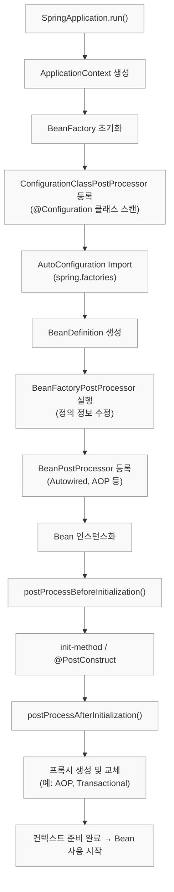
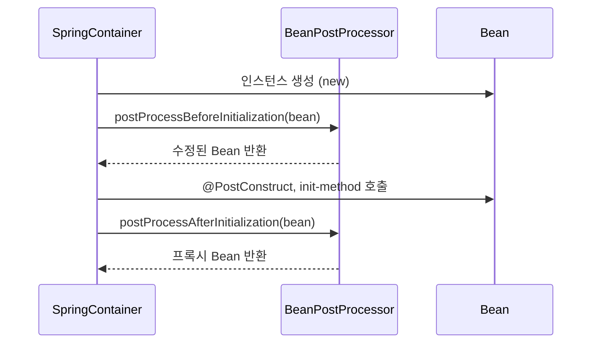
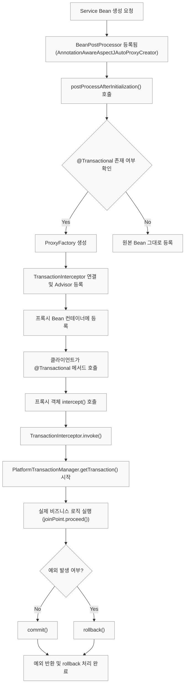
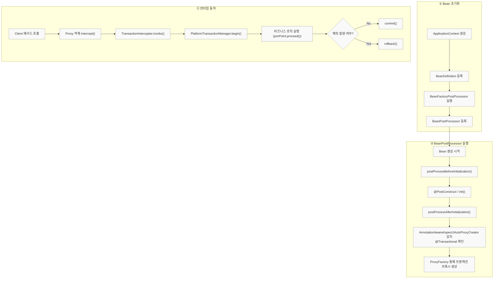

# 📚 Spring 핵심 개념 정리(BeanPostProcessor)

---

# <mark> BeanPostProcessor 전체 구조 & Spring Boot 자동 등록 메커니즘 </mark>

---

## 1️⃣ BeanPostProcessor란?

`BeanPostProcessor`는 스프링 컨테이너가 **Bean 객체를 생성한 뒤, 초기화 전후 시점에 가로채어 가공할 수 있는 훅(Hook)**을 제공합니다.
즉, Bean의 **“생성 이후 - 초기화 전후”** 과정에 개입해 **프록시 생성, 의존성 주입, 커스텀 로직 적용** 등을 수행합니다.

| 구분                           | 설명                                                                                          |
| ---------------------------- | ------------------------------------------------------------------------------------------- |
| **BeanFactoryPostProcessor** | Bean “정의(Definition)”를 수정하는 단계 (아직 객체는 생성 전)                                                |
| **BeanPostProcessor**        | Bean “객체(Object)”를 수정하는 단계 (객체 생성 이후)                                                       |
| **호출 시점**                    | `postProcessBeforeInitialization()` → 초기화 전 <br> `postProcessAfterInitialization()` → 초기화 후 |
| **주요 목적**                    | 프록시 생성, 의존성 주입, 커스텀 어노테이션 처리 등                                                              |

---

## 2️⃣ 핵심 요약

| 구분                  | 설명                                                                                                               |
| ------------------- | ---------------------------------------------------------------------------------------------------------------- |
| **직접 구현**           | 특정 Bean만 가공하거나, 커스텀 기능(`@MyAnnotation` 등)을 추가하고 싶을 때 직접 구현                                                       |
| **자동 사용 (대부분의 경우)** | Spring Boot가 `@Autowired`, `@PostConstruct`, `@Transactional`, `@Async`, `@Configuration` 등을 처리하기 위해 내부적으로 자동 등록 |


> “`@Autowired` 붙였더니 주입이 되네?”
> “`@Transactional`만 붙였는데 트랜잭션이 걸리네?”
>
> → 이 모든 것 뒤에는 **BeanPostProcessor가 자동으로 동작**하고 있는 것입니다.

---

## 3️⃣ 예시 — 어떤 어노테이션이 어떤 BeanPostProcessor로 처리될까?

| 기능                              | 실제로 동작시키는 BeanPostProcessor                                        |
| ------------------------------- | ------------------------------------------------------------------ |
| `@Autowired`, `@Value`          | `AutowiredAnnotationBeanPostProcessor`                             |
| `@PostConstruct`, `@PreDestroy` | `CommonAnnotationBeanPostProcessor`                                |
| `@Transactional`                | `AnnotationAwareAspectJAutoProxyCreator` (AOP 기반 BPP)              |
| `@Configuration` 클래스 인식         | `ConfigurationClassPostProcessor`                                  |
| `@Async`, `@EventListener`      | `AsyncAnnotationBeanPostProcessor`, `EventListenerMethodProcessor` |

이들은 **Spring Boot의 AutoConfiguration 단계**에서 자동으로 등록됩니다.
→ 즉, 우리가 직접 Bean으로 등록하지 않아도 알아서 동작합니다.

---

## 4️⃣ Spring Boot 내부에서 BPP가 등록되는 과정

Spring Boot는 **`ApplicationContext` 초기화 과정**에서
여러 `BeanPostProcessor`를 자동으로 스캔하고 등록합니다.

아래는 **스프링 컨테이너 초기화 시점의 전체 흐름**입니다.




> 정리하자면
> 1️⃣ `ConfigurationClassPostProcessor`가 `@Configuration` 클래스를 스캔
> 2️⃣ `AutoConfiguration` 단계에서 스프링이 필요한 `BPP`를 자동 등록
> 3️⃣ Bean 생성 후 `postProcessAfterInitialization()`에서
> `@Transactional`, `@Async`, `@Autowired` 등을 감지해
> **AOP 프록시 또는 주입 로직을 자동 적용**

---

## 5️⃣ 실제 등록 예시 (스프링 내부 클래스)

| BeanPostProcessor                        | 역할                                     |
| ---------------------------------------- | -------------------------------------- |
| `AutowiredAnnotationBeanPostProcessor`   | `@Autowired`, `@Value` 처리              |
| `CommonAnnotationBeanPostProcessor`      | `@PostConstruct`, `@PreDestroy` 처리     |
| `ConfigurationClassPostProcessor`        | `@Configuration`, `@Bean` 분석 및 Bean 등록 |
| `EventListenerMethodProcessor`           | `@EventListener` 등록 처리                 |
| `AsyncAnnotationBeanPostProcessor`       | `@Async` 메서드 비동기 프록시 생성                |
| `AnnotationAwareAspectJAutoProxyCreator` | `@Transactional`, AOP 프록시 생성 핵심        |
| `ScheduledAnnotationBeanPostProcessor`   | `@Scheduled` 태스크 등록 처리                 |

이들은 대부분 `spring-context`, `spring-aop`, `spring-tx`, `spring-boot-autoconfigure` 모듈에서 자동 등록됩니다.

---

## 6️⃣ BeanPostProcessor 동작 시점 요약



---

## 7️⃣ 직접 구현하는 경우 (예시)

직접 BPP를 구현해야 하는 경우는 흔치 않습니다.
하지만 예를 들어 특정 커스텀 어노테이션(`@LogExecutionTime`)이 붙은 Bean의 메서드를 감싸고 싶다면 다음처럼 구현할 수 있습니다.

```java
@Component
public class LogExecutionTimePostProcessor implements BeanPostProcessor {

    @Override
    public Object postProcessAfterInitialization(Object bean, String beanName) {
        if (bean.getClass().isAnnotationPresent(LogExecutionTime.class)) {
            return Proxy.newProxyInstance(
                    bean.getClass().getClassLoader(),
                    bean.getClass().getInterfaces(),
                    (proxy, method, args) -> {
                        long start = System.currentTimeMillis();
                        Object result = method.invoke(bean, args);
                        long end = System.currentTimeMillis();
                        System.out.println(method.getName() + " 실행 시간: " + (end - start) + "ms");
                        return result;
                    });
        }
        return bean;
    }
}
```

> 이렇게 하면 `@LogExecutionTime`이 붙은 Bean은
> Bean 생성 시 자동으로 **프록시로 감싸져 실행 시간을 출력**합니다.

---

## 8️⃣ 핵심 결론

| 구분              | 내용                                                                                 |
| --------------- | ---------------------------------------------------------------------------------- |
| **핵심 메커니즘**     | BeanPostProcessor가 Bean 초기화 직후 AOP, 주입, 초기화 로직을 자동 처리                              |
| **자동 등록 주체**    | Spring Boot의 AutoConfiguration                                                     |
| **실행 시점**       | Bean 초기화 이후 (AfterInitialization)                                                  |
| **대표 클래스**      | `AnnotationAwareAspectJAutoProxyCreator`, `AutowiredAnnotationBeanPostProcessor` 등 |
| **개발자 역할**      | 대부분의 경우 “@Transactional, @Autowired 등 어노테이션만 붙이면 끝”                                |
| **직접 구현 필요 시점** | 커스텀 어노테이션 처리, 특정 Bean 가공, 프록시 기반 로깅 등                                              |

---


# <mark> BeanPostProcessor → AOP → @Transactional → 트랜잭션 동작 전체 흐름 </mark>

---

## 1️⃣ BeanPostProcessor의 역할 요약

| 구분                           | 역할                                                                                                                                 |
| ---------------------------- | ---------------------------------------------------------------------------------------------------------------------------------- |
| **BeanFactoryPostProcessor** | Bean “정의(Definition)” 수정 단계                                                                                                        |
| **BeanPostProcessor**        | Bean “인스턴스(Object)” 수정 단계                                                                                                          |
| **주요 역할**                    | Bean 초기화 전/후에 개입해 가공, 프록시 생성 등 수행                                                                                                  |
| **스프링이 자동 등록하는 주요 BPP**      | `AutowiredAnnotationBeanPostProcessor`, `CommonAnnotationBeanPostProcessor`, **`AnnotationAwareAspectJAutoProxyCreator` (AOP 핵심)** |

> 💡 `AnnotationAwareAspectJAutoProxyCreator` (줄여서 **AAAPC**)
> → 바로 `@Transactional`을 보고 해당 Bean을 트랜잭션 프록시로 감싸주는 **BeanPostProcessor** 입니다.

---

## 2️⃣ @Transactional 처리 핵심 구조

### 전체 흐름 요약

1. `@Transactional`이 붙은 Bean이 생성되면
2. `AnnotationAwareAspectJAutoProxyCreator`(BPP)가 개입
3. Bean이 트랜잭션 관련 Advisor 대상인지 검사
4. 맞다면 `ProxyFactory`를 이용해 **프록시 객체 생성**
5. 이후 메서드 호출은 프록시를 통해 **`TransactionInterceptor`**로 전달되어
   트랜잭션이 **시작 / 커밋 / 롤백**됨

---

## 3️⃣ 내부 개념 구조 (요약 다이어그램)

```
Client
   ↓
@Transactional 메서드 호출
   ↓
[프록시 객체] (AOP Proxy)
   ↓
TransactionInterceptor.invoke()
   ├─ PlatformTransactionManager.getTransaction() → 트랜잭션 시작
   ├─ joinPoint.proceed() → 실제 비즈니스 로직 실행
   ├─ commit() or rollback()
   ↓
DB Connection 제어 (commit/rollback)
```

---

## 4️⃣ 스프링 내부 동작 단계별 설명

| 단계 | 컴포넌트                                           | 설명                                                       |
| -- | ---------------------------------------------- | -------------------------------------------------------- |
| 1  | `AnnotationAwareAspectJAutoProxyCreator` (BPP) | BeanPostProcessor로 등록되어 Bean 초기화 후 @Transactional 여부를 검사 |
| 2  | Advisor / Pointcut / Advice                    | @Transactional 인식 시 TransactionInterceptor를 Advisor로 등록  |
| 3  | ProxyFactory                                   | 실제 Bean 대신 프록시를 만들어 교체                                   |
| 4  | TransactionInterceptor                         | 프록시 호출 시 트랜잭션 시작, 예외 시 rollback                          |
| 5  | PlatformTransactionManager                     | 실제 DB Connection 단위 트랜잭션 관리                              |

---

## 5️⃣ Mermaid 다이어그램 — 전체 과정 시각화



---

## 6️⃣ 실제 코드 레벨 대응

| 클래스                                      | 역할                       |
| ---------------------------------------- | ------------------------ |
| `AnnotationAwareAspectJAutoProxyCreator` | BPP + AOP 프록시 생성 담당      |
| `InfrastructureAdvisorAutoProxyCreator`  | AOP Advisor 자동 등록        |
| `TransactionInterceptor`                 | 트랜잭션 시작/커밋/롤백 로직 핵심      |
| `PlatformTransactionManager`             | DB Connection 수준 트랜잭션 관리 |
| `ProxyFactory`, `CglibAopProxy`          | 실제 프록시 객체 생성             |

---

## 7️⃣ 핵심 요약 문장

> `@Transactional`은 단순한 어노테이션이 아니다.
> 스프링은 `AnnotationAwareAspectJAutoProxyCreator` (BeanPostProcessor)를 통해
> `@Transactional`이 붙은 Bean을 감지하고,
> 이를 `TransactionInterceptor`가 포함된 **AOP 프록시**로 감싼다.
> 이후 메서드 호출 시 `TransactionInterceptor`가
> `PlatformTransactionManager`를 이용해 트랜잭션을 시작하고,
> 정상 종료 시 **commit**, 예외 발생 시 **rollback**을 수행한다.
> 개발자는 단지 `@Transactional`만 붙이면 모든 제어가 자동으로 이루어진다.

---

## 8️⃣ 전체 요약 — Bean 생성 → 프록시 → 트랜잭션 제어



---
## ✍️ 오늘의 회고

오늘은 잠을 푹 자서 그런지 집중하기에 최적의 컨디션이었다.
하지만 내용이 너무 어려워서 오히려 집중이 잘 되지 않았다.
핑계일 수도 있지만, 머리에 과부하가 온 느낌이라 새로운 내용이 잘 들어오지 않았다.

그래도 어제 생각했던 것처럼 “일단 정리부터 하자”는 마음으로 꾸준히 내용을 정리했다.
오늘 배운 개념은 BeanPostProcessor, 동적 프록시, 그리고 JDK Proxy였지만
모두 깊이 있는 주제라 한 번에 다 정리하기엔 벅찼다.

수업 전에 한 번 더 복습하고 들어가는 게 좋을 것 같다.
또한 CGLIB을 배우게 되는 내일,
오늘 공부한 동적 프록시와 JDK Proxy 개념과 함께 정리해볼 예정이다.
