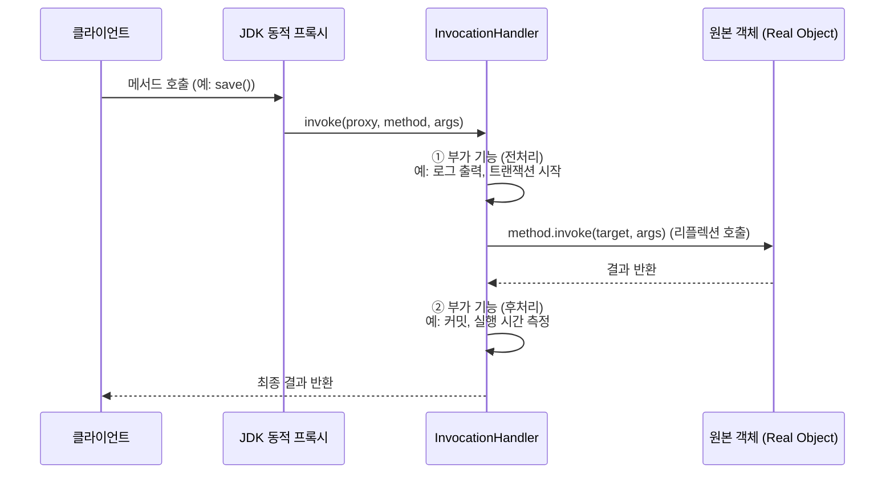
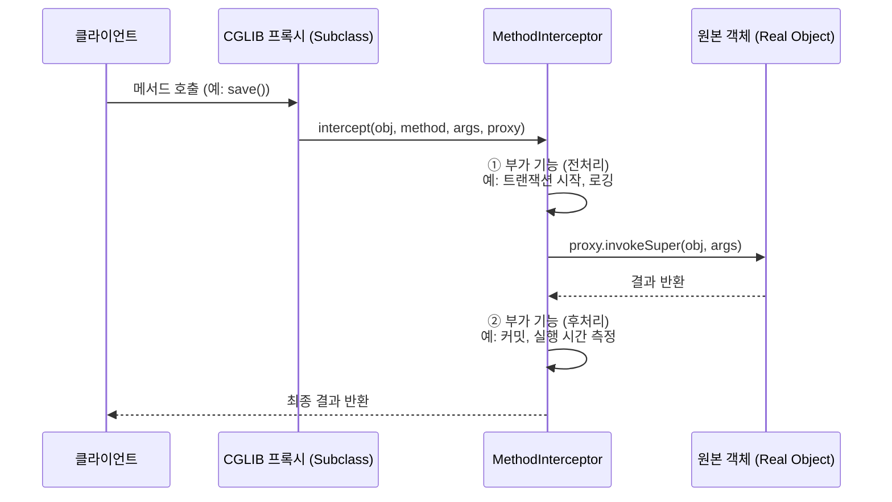
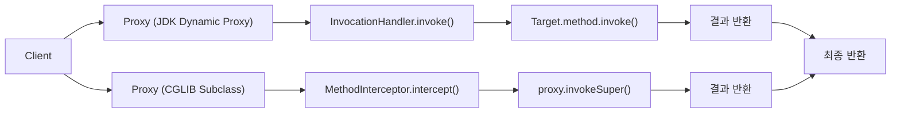
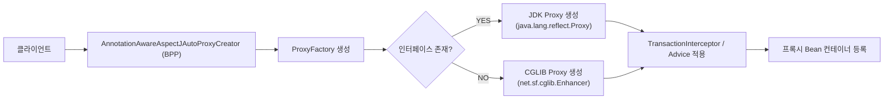

# 📚 Spring 핵심 개념 정리(Dynamic Proxy, ProxyFactory)

---
# <mark> 동적 프록시(Dynamic Proxy) 정리 </mark>

---

## 프록시(Proxy)란?

**프록시(Proxy)** 는 원본 객체(Real Object)를 감싸서

**메서드 호출 전후에 부가 기능(로깅, 트랜잭션, 보안 등)** 을 삽입하는 **디자인 패턴**이에요.

> “클라이언트는 원본 Bean을 직접 호출한다고 생각하지만,
> 
> 
> 실제로는 프록시가 호출을 가로채 부가 로직을 수행한다.”
> 

---

## 스프링 AOP에서의 프록시 구조

```
[Client]
   ↓
[Proxy Bean]  ← (AOP 프록시)
   ↓
[Target Bean] ← (실제 비즈니스 로직)

```

프록시는 메서드 호출을 가로채 다음과 같은 **공통 부가기능(Cross-Cutting Concern)** 을 수행합니다.

- 트랜잭션 시작 / 커밋 / 롤백
- 로깅, 성능 측정
- 인증/인가
- 캐싱

---

## [동적 프록시] 사용하는 이유

| 항목 | 설명 |
| --- | --- |
| **사용 이유** | 원본 코드 수정 없이 **공통 부가기능을 핵심 로직에서 분리**하기 위해 |
| **미사용 시 문제** | 코드 중복, 유지보수 어려움, 핵심 로직 오염 |
| **핵심 목표** | **관심사 분리(Separation of Concerns)** — 트랜잭션, 보안, 로깅을 독립적으로 관리 |

동적 프록시는 **AOP(관점 지향 프로그래밍)** 의 기반이며,

Spring은 이를 통해 `@Transactional`, `@Async`, `@Cacheable`, `@Secured` 등을 자동 처리합니다.

---

## 동적 프록시(Dynamic Proxy)란?

> “프록시 클래스를 컴파일 시점이 아닌 런타임에 동적으로 생성하는 기술”
> 

정적 프록시와 달리,

동적 프록시는 개발자가 클래스를 직접 작성하지 않아도

스프링이 런타임에 **프록시 객체를 자동 생성**해줍니다.

---

## 두 가지 동적 프록시 방식

| 구분 | 방식 | 특징 |
| --- | --- | --- |
| ① | **JDK Dynamic Proxy** | 인터페이스 기반 프록시 생성 |
| ② | **CGLIB Proxy** | 클래스 상속 기반 프록시 생성 |

---

# <mark>JDK Dynamic Proxy </mark>

### 핵심 특징

- Java 표준 라이브러리 (`java.lang.reflect.Proxy`) 기반
- **인터페이스가 반드시 존재해야 함**
- 프록시는 인터페이스 타입을 구현한 익명 클래스 형태로 생성됨

---

### 내부 구조

```java
MyService proxy = (MyService) Proxy.newProxyInstance(
    MyService.class.getClassLoader(),
    new Class[]{MyService.class},
    new InvocationHandler() {
        @Override
        public Object invoke(Object proxy, Method method, Object[] args) throws Throwable {
            System.out.println("Before method: " + method.getName());
            Object result = method.invoke(realService, args); // Reflection
            System.out.println("After method: " + method.getName());
            return result;
        }
    }
);

```

결과

- `proxy`는 `MyService` 인터페이스를 구현한 **런타임 프록시 객체**
- `invoke()` 메서드에서 **모든 호출을 가로채 부가기능 수행**

---

### InvocationHandler

- 모든 메서드 호출을 **하나의 invoke() 메서드로 위임**
- 공통 로직(부가기능)을 한 곳에서 처리 가능 → **중복 코드 제거**

---

### Reflection API

> 클래스 이름을 몰라도 런타임에 메서드, 필드, 생성자 정보에 접근할 수 있게 해주는 자바 표준 API
> 
- 내부적으로 `method.invoke(target, args)` 형태로 호출
- 다만 **정적 호출보다 느리다** (JIT 최적화 이전에는 오버헤드 존재)
- 스프링은 이 오버헤드를 최소화하기 위해 캐싱 및 리플렉션 최적화를 수행함

---

# <mark> CGLIB Proxy (클래스 기반 프록시)</mark> 

### 핵심 특징

- **인터페이스가 없어도 동작 가능**
- 원본 클래스를 **상속(subclass)** 하여 프록시 생성
- `final` 클래스나 `final` 메서드는 프록시 불가

---

### 내부 구조

```java
Enhancer enhancer = new Enhancer();
enhancer.setSuperclass(MyService.class);
enhancer.setCallback((MethodInterceptor) (obj, method, args, proxy) -> {
    System.out.println("Before: " + method.getName());
    Object result = proxy.invokeSuper(obj, args);
    System.out.println("After: " + method.getName());
    return result;
});
MyService proxy = (MyService) enhancer.create();

```

결과

- `proxy`는 `MyService`를 **상속받은 익명 서브클래스**
- `invokeSuper()`를 통해 원본 메서드 호출

---

### Spring에서 CGLIB Proxy가 사용되는 조건

| 조건 | 설명 |
| --- | --- |
| 인터페이스가 없음 | CGLIB 자동 사용 |
| `proxyTargetClass = true` | 명시적으로 CGLIB 강제 사용 |
| `@EnableAspectJAutoProxy(proxyTargetClass = true)` | AOP 전역 옵션으로 CGLIB 지정 |

---

### 현재 CGLIB Proxy 사용이 쉬운 이유

이전에는 별도 라이브러리(`cglib-nodep.jar`)가 필요했지만

**Spring 3.2 이후부터 CGLIB이 스프링 코어에 통합**되어

추가 의존성 없이 바로 사용 가능하게 되었습니다 

---

# 두 프록시 비교

| 항목 | **JDK Dynamic Proxy** | **CGLIB Proxy** |
| --- | --- | --- |
| 기반 | Java 표준 (`Proxy`, `InvocationHandler`) | Bytecode 조작 (`net.sf.cglib`) |
| 대상 | 인터페이스 기반 | 클래스 기반 |
| 구현 방식 | 인터페이스 구현 | 클래스 상속 |
| final 클래스/메서드 | 불가 | 불가 |
| 생성 속도 | 빠름 | 상대적으로 느림 |
| 런타임 성능 | 유사 | 유사 (JIT 최적화 후 거의 차이 없음) |
| 스프링 기본 전략 | 인터페이스 존재 시 JDK | 인터페이스 없을 시 CGLIB |
| 대표 사용 | @Transactional, @Async, @Cacheable | 동일하게 사용 가능 |

---

## JDK Dynamic Proxy 실행 흐름

> 인터페이스 기반 프록시
> 
> 
> `java.lang.reflect.Proxy` 와 `InvocationHandler` 를 이용
> 
> 인터페이스가 있어야 동작하며, 리플렉션으로 메서드를 호출함.
> 



### 주요 포인트

| 항목 | 설명 |
| --- | --- |
| 프록시 생성 | `Proxy.newProxyInstance()` |
| 핵심 인터페이스 | `InvocationHandler` |
| 호출 방식 | `method.invoke()` (Reflection) |
| 장점 | 표준 자바 API, 구현 간단 |
| 단점 | 인터페이스 필수, 리플렉션 호출 오버헤드 |

---

## CGLIB Proxy 실행 흐름

> 클래스 상속 기반 프록시
> 
> 
> `Enhancer` 와 `MethodInterceptor` 를 이용
> 
> 인터페이스가 없어도 동작하며, **바이트코드로 프록시 클래스를 생성**함.
> 



### 주요 포인트

| 항목 | 설명 |
| --- | --- |
| 프록시 생성 | `Enhancer.create()` |
| 핵심 인터페이스 | `MethodInterceptor` |
| 호출 방식 | `proxy.invokeSuper()` |
| 장점 | 인터페이스 없어도 사용 가능 |
| 단점 | `final` 클래스/메서드는 불가, 생성 시 바이트코드 비용 |

---

## 두 방식의 구조 비교

| 구분 | **JDK Dynamic Proxy** | **CGLIB Proxy** |
| --- | --- | --- |
| 프록시 생성 | `Proxy.newProxyInstance()` | `Enhancer.create()` |
| 기반 기술 | Java Reflection API | 바이트코드 조작 (ASM) |
| 필수 조건 | 인터페이스 필요 | 클래스 상속으로 가능 |
| 메서드 호출 | `method.invoke(target, args)` | `proxy.invokeSuper(obj, args)` |
| 핵심 인터페이스 | `InvocationHandler` | `MethodInterceptor` |
| 성능 | 약간 빠름 (경량) | 생성 시 느림, 실행은 유사 |
| 제약 | 인터페이스 필수 | final 클래스/메서드 불가 |
| 스프링 기본 전략 | 인터페이스 존재 시 JDK | 없으면 CGLIB |
| 실제 사용 예 | `@Transactional`, `@Async` | `@Transactional`, `@Cacheable` |

---

## 두 프록시 동작 차이 시각화 (요약 비교)



---

## 핵심 요약

> JDK Dynamic Proxy는 인터페이스 기반, InvocationHandler로 리플렉션을 사용하고
> 
> 
> CGLIB Proxy는 **클래스 상속 기반**, `MethodInterceptor`로 바이트코드를 조작한다.
> 
> 스프링은 Bean에 인터페이스가 있으면 **JDK Proxy**,
> 
> 없으면 자동으로 **CGLIB Proxy**를 사용해
> 
> `@Transactional`, `@Async`, `@Cacheable` 같은 부가기능을 적용한다.
> 

---

---

| 구분 | 요약 |
| --- | --- |
| **동적 프록시 사용 이유** | 원본 코드 수정 없이 공통 로직(트랜잭션, 보안 등) 삽입 |
| **JDK Proxy** | 인터페이스 기반, `InvocationHandler`로 호출 제어 |
| **CGLIB Proxy** | 클래스 상속 기반, `MethodInterceptor`로 호출 제어 |
| **Reflection API** | 런타임에 메서드 실행 제어 (성능은 캐싱으로 보완) |
| **Spring 통합** | CGLIB은 Spring Core에 내장되어 별도 설정 불필요 |
| **AOP 핵심 포인트** | BeanPostProcessor가 Bean을 감싸서 프록시로 교체 |

---

# 정리 문장 (한 줄 요약)

> Spring은 BeanPostProcessor(AnnotationAwareAspectJAutoProxyCreator)를 통해
> 
> 
> Bean을 **동적 프록시(JDK 또는 CGLIB)** 로 감싸며,
> 
> 개발자는 코드 수정 없이 트랜잭션, 보안, 캐싱 등 **공통 기능을 선언적으로 적용**할 수 있다.
> 
> 이것이 **Spring AOP의 핵심 원리**이다.
> 

---

# <mark> ProxyFactory 개념 정리 </mark>

지금까지 설명한 **JDK Dynamic Proxy**와 **CGLIB Proxy**는

“**프록시를 실제로 만드는 두 가지 기술**”이라면,

👉 **`ProxyFactory`** 는 **그 두 기술을 감싸서 추상화한 스프링의 핵심 클래스**예요.

> “JDK Proxy”와 “CGLIB Proxy”는 실행 엔진,
> 
> 
> “ProxyFactory”는 **스프링이 그 엔진을 선택하고 관리하는 조정자(Factory)** 입니다.
> 

---

---

## ProxyFactory란?

> 스프링 AOP에서 프록시 객체를 생성하기 위한 중앙 제어 클래스
> 

핵심 역할:

- 대상 객체(`Target`)과 부가기능(`Advice`)을 받아
- 내부적으로 **JDK Dynamic Proxy** 또는 **CGLIB Proxy** 중 하나를 자동으로 선택해 생성함

---

## ProxyFactory의 구조 요약

```java
ProxyFactory factory = new ProxyFactory();
factory.setTarget(new MemberServiceImpl());  // 실제 비즈니스 로직 객체
factory.addAdvice(new TimeAdvice());         // 부가기능 (AOP Advice)
Object proxy = factory.getProxy();           // 프록시 생성

```

내부 동작 순서:

1️⃣ `ProxyFactory`가 타깃 클래스 분석

2️⃣ **인터페이스가 있으면 → JDK Proxy**

3️⃣ **없으면 → CGLIB Proxy**

4️⃣ `Advice`를 프록시에 연결하여 메서드 호출 시 **intercept() / invoke()** 로 위임

5️⃣ 완성된 프록시 객체 반환

---

요약:

`ProxyFactory`는 스프링이 내부적으로 프록시 생성 방식을 결정할 때 사용하는

“**자동 선택 로직을 가진 추상화 계층**”이에요.

---

## 최종 구조 요약



---
## ✍️ 오늘의 회고
오늘 오전에는 역대급으로 집중이 잘 되지 않았다. 그냥 이해조차 하지 않으려 했던 것 같다.
“나중에 혼자 공부하지 뭐”라는 생각으로 대충 넘기고, 오후에 멘토링을 했다.
그런데 멘토님께서 하신 말씀이 유난히 마음에 남았다.

“지금 힘든 거 알아요. 근데 프론트엔드 준비하시는 분들도, 지금 아니면 언제 백엔드 깊게 공부해보겠어요?”

그 말에 갑자기 머리가 맑아지는 느낌이었다.
지금이 아니면 이런 환경, 이런 몰입 기회는 다시 오지 않을 수도 있겠구나 싶었다.
그래서 오늘은 집중이 안 된 만큼, 내일은 의식적으로 더 집중하려고 한다.
단순히 코드를 따라 쓰는 게 아니라, “왜 이렇게 동작하는지”를 스스로 이해하려는 태도로.

그리고 오늘은… 환승연애 하는 날이다.
그래서 밤에는 잠깐 쉬어가며 마음의 여유도 조금 가져야겠다 😌
