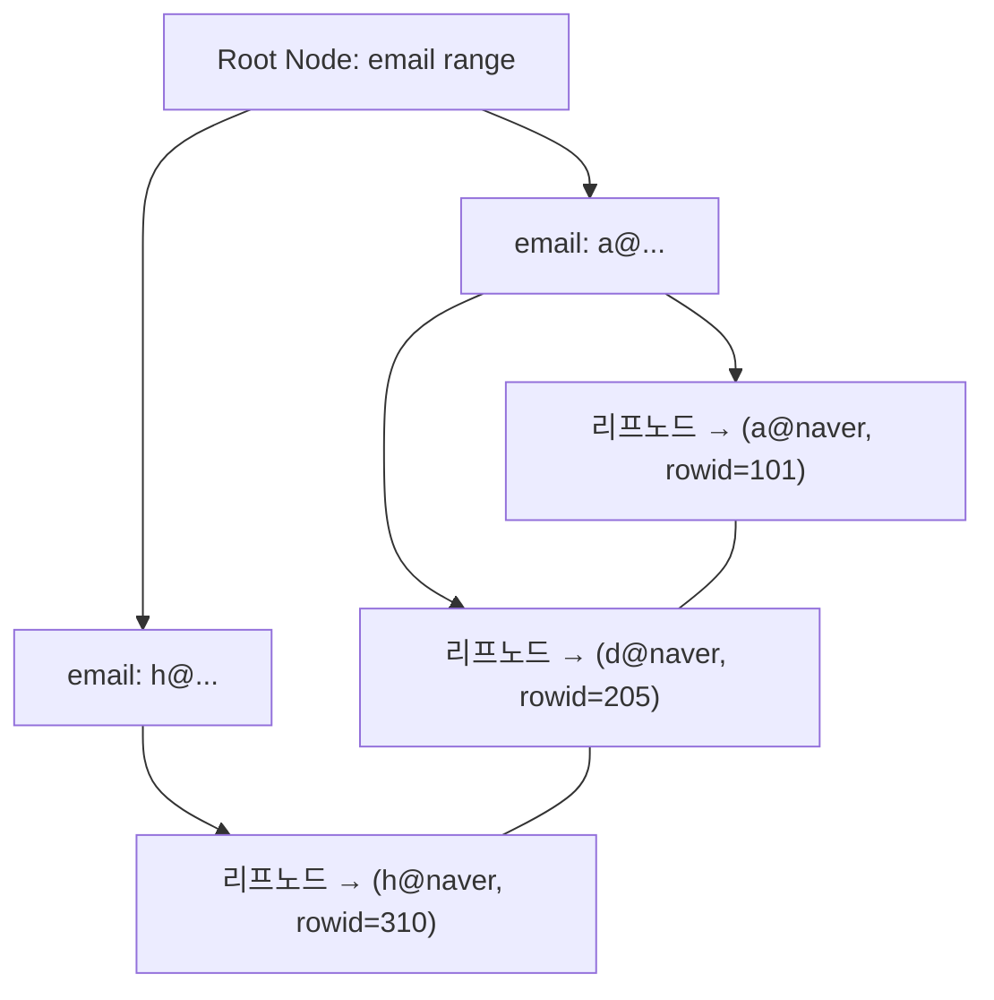

# 📚DB 핵심 개념 정리(ERD,  Index)

---
## <mark> 1️⃣ ERD (Entity Relationship Diagram)  </mark>

### 개념

ERD는 **데이터베이스 논리 설계 단계**에서 **엔티티(테이블)**, **속성(컬럼)**, **관계(relationship)** 를 시각적으로 표현한 다이어그램.

| 구성요소 | 의미 | 예시 |
| --- | --- | --- |
| **Entity (엔티티)** | 저장할 데이터의 집합, 즉 테이블 | `User`, `Order`, `Product` |
| **Attribute (속성)** | 각 엔티티가 가진 데이터 항목 | `user_id`, `name`, `email` |
| **Relationship (관계)** | 엔티티 간 연관성 | User 1 : N Order |

### 관계 유형

| 관계 | 설명 | 예시 |
| --- | --- | --- |
| 1 : 1 | 한 엔티티의 한 행이 다른 엔티티의 한 행에만 연결 | `User` ↔ `UserProfile` |
| 1 : N | 한 엔티티의 한 행이 다른 엔티티의 여러 행에 연결 | `User` ↔ `Order` |
| N : M | 다대다 관계 (중간 테이블 필요) | `Student` ↔ `Course` (via `Enrollment`) |

### 키(Key)

| 종류 | 역할 | 설명 |
| --- | --- | --- |
| **PK (Primary Key)** | 기본키 | 행을 고유하게 식별 |
| **FK (Foreign Key)** | 외래키 | 다른 테이블의 PK 참조 |
| **CK (Candidate Key)** | 후보키 | PK로 지정될 수 있는 키들 |
| **AK (Alternate Key)** | 대체키 | PK 외의 고유한 키 |
| **SK (Surrogate Key)** | 대체 인조키 | 의미 없는 숫자 ID (`AUTO_INCREMENT`) |

---

##  <mark> 2️⃣ Index (인덱스)  </mark>

### 개념

인덱스는 **데이터 검색 속도를 높이기 위해** DB 내부에 별도로 만들어진 **정렬된 자료 구조**.

---

## 3️⃣ 내부 동작 방식

### 인덱스의 핵심 자료구조: **B-Tree / B+Tree**

대부분의 RDBMS(MySQL, Oracle, PostgreSQL)는 **B+Tree 기반 인덱스**를 사용.

### 동작 원리

1. 인덱스는 **Key**(정렬된 값) + **Pointer(데이터 위치)** 쌍으로 구성
2. B+Tree는 루트 → 중간 노드 → 리프 노드 구조로 트리 형태 유지
3. 탐색은 **O(logN)** 으로, 매우 빠르게 키를 찾음
4. 리프 노드에 실제 데이터의 위치(RID: Row ID)나 PK를 저장
5. 찾은 Key의 위치를 따라가서 실제 테이블 데이터를 읽음

### B-Tree와 B+Tree의 차이

| 구조 | 설명 |
| --- | --- |
| **B-Tree** | 모든 노드에 데이터 존재 |
| **B+Tree** | 리프 노드에만 데이터 존재 → 리프끼리 연결(Linked list)되어 **Range Scan** 효율 ↑ |

---

## 4️⃣ 클러스터드 vs 비클러스터드 인덱스

| 구분 | 클러스터드 인덱스 (Clustered Index) | 비클러스터드 인덱스 (Non-Clustered Index) |
| --- | --- | --- |
| **정의** | 테이블 자체가 인덱스 구조로 저장됨 | 인덱스가 별도 공간에 존재 |
| **저장 구조** | 리프 노드 = 실제 데이터 | 리프 노드 = 데이터의 포인터 |
| **정렬 방식** | 물리적으로 정렬 | 논리적으로만 정렬 |
| **갯수** | 테이블당 1개만 가능 | 여러 개 생성 가능 |
| **조회 속도** | 매우 빠름 (데이터 직접 접근) | 약간 느림 (포인터 따라가야 함) |
| **예시** | PK 자동 생성 시 | 자주 조회되는 컬럼 (예: `email`, `username`) |

---

## 5️⃣ 인덱스 검색 과정 예시

예를 들어, `SELECT * FROM user WHERE email = 'abc@naver.com';` 이 실행되면

```
1️⃣ email 컬럼에 인덱스 존재 확인
2️⃣ B+Tree 탐색: email='abc@naver.com' 키를 logN 시간에 찾음
3️⃣ (비클러스터드 인덱스인 경우) → 실제 행 주소(Row ID) 따라가서 테이블 접근
4️⃣ 결과 반환

```

👉 만약 email 컬럼에 인덱스가 없다면?

→ 전체 테이블 스캔(Full Table Scan) 발생 → 시간복잡도 O(N)

---

## 6️⃣ 인덱스 설계 시 고려사항

| 고려 항목 | 설명 |
| --- | --- |
| **선택도(Selectivity)** | 중복이 적은 컬럼에 인덱스 생성 |
| **카디널리티(Cardinality)** | 유니크할수록 인덱스 효율 ↑ |
| **WHERE / JOIN 조건 컬럼** | 자주 필터링, 조인되는 컬럼 |
| **ORDER BY / GROUP BY 컬럼** | 정렬/그룹 최적화 효과 |
| **업데이트 빈도** | INSERT/UPDATE/DELETE 많은 컬럼은 인덱스 오히려 비효율 |

---

## 7️⃣ 인덱스 관련 SQL 예시

```sql
-- 인덱스 생성
CREATE INDEX idx_user_email ON user(email);

-- 클러스터드 인덱스 (PK 자동)
CREATE TABLE user (
    id BIGINT PRIMARY KEY AUTO_INCREMENT,
    email VARCHAR(255),
    name VARCHAR(50)
);

-- 복합 인덱스 (멀티컬럼)
CREATE INDEX idx_user_name_email ON user(name, email);

-- 인덱스 조회
SHOW INDEX FROM user;

```

---

## 8️⃣ 시각적 요약 (B+Tree 구조 예시)



➡️ **리프 노드**들은 Linked list로 연결되어 있어서

`BETWEEN`, `LIKE 'abc%'` 같은 **범위 검색**이 빠름.

---
