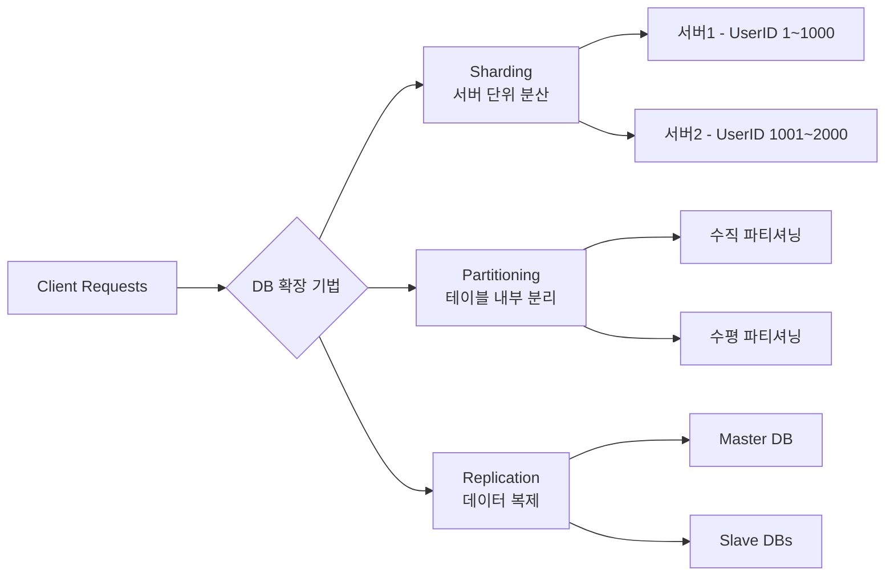

# 📚DB 핵심 개념 정리(NoSQL, 데이터베이스 확장)

# <mark> NoSQL (Not Only SQL)  </mark>

## 1️⃣ 개념

- **정의**:
    
    NoSQL은 “Not Only SQL”의 약자로,
    
    **전통적인 관계형 데이터베이스(RDBMS)의 한계를 보완하기 위해 등장한 비관계형 데이터베이스**이다.
    
    유연한 데이터 구조 → 유연한 구조가 필요한 이유는 다양한 데이터를 다루기 위함. 
    
- **특징**
    - **고정 스키마 없음 (Schema-less)**
    - **수평 확장(Scale-Out)** 용이
    - **대용량 비정형 데이터 처리에 적합**
    - **CAP 이론**(Consistency, Availability, Partition tolerance)에 기반한 설계
    - 대규모 데이터 처리: 절대적으로 많은 양을 데이터를 위함.  단순히 사용자가 생성한 데이턱 아닌 분석을 위한 데이터 포함.

---

## 2️⃣ 동작 방식 (Operation Model)

NoSQL 데이터베이스는 **데이터 저장 구조와 접근 방식**에 따라 다음과 같이 구분된다.

| 구분 | 설명 | 대표 예시 |
| --- | --- | --- |
| **① 키-값 저장소 (Key-Value Stores)** | 하나의 Key에 하나의 Value를 저장하는 가장 단순한 구조 | Redis, Amazon DynamoDB |
| **② 문서 지향 데이터베이스 (Document Oriented Databases)** | JSON, BSON 형태의 문서를 저장. 필드가 유연하며 중첩 구조 가능 | MongoDB, CouchDB |
| **③ 컬럼 기반 데이터베이스 (Column-based Databases)** | 행(Row)이 아닌 컬럼 단위로 데이터를 저장. 대량 분석에 강함 | Apache Cassandra, HBase |
| **④ 그래프 데이터베이스 (Graph Databases)** | 노드(Node)와 간선(Edge)으로 구성되어 관계형 데이터를 표현 | Neo4j, ArangoDB |

---

## 3️⃣ 유형별 동작 방식 (Type-specific Operation Model)

### ① 키-값 저장소 (Key-Value Store)

- **구조**: `{ "key": "value" }` 형태로 단순한 Key-Value 매핑
- **특징**
    - 매우 빠른 조회 속도 (O(1) 접근)
    - 복잡한 쿼리나 조인 불가
- **활용 예시**: 세션 관리, 캐시, 실시간 랭킹
- **대표 DB**: Redis, DynamoDB, Riak

---

### ② 문서 저장소 (Document Oriented Databases)

- **구조**: JSON, BSON 문서 형태로 데이터 저장
- **특징**
    - 각 문서는 독립적 구조 (필드 추가/삭제 자유로움)
    - 중첩 데이터 구조 표현 가능
    - 인덱스, 조건 검색 지원
- **활용 예시**: 사용자 정보, 로그 데이터, CMS
- **대표 DB**: MongoDB, CouchDB, Elasticsearch

---

### ③ 컬럼 기반 저장소 (Column-Family Store)

- **구조**: 행(Row)보다는 컬럼(Column) 단위로 데이터 저장
- **특징**
    - 특정 컬럼만 빠르게 조회 가능 → 대용량 분석에 유리
    - 테이블 구조 유사하지만 스키마가 유연
    - HDFS 기반 분산 저장 지원
- **활용 예시**: 로그 분석, 빅데이터 통계, IoT 데이터
- **대표 DB**: Apache Cassandra, HBase, ScyllaDB

---

### ④ 그래프 데이터베이스 (Graph Database)

- **구조**: 노드(Node)와 간선(Edge)로 구성된 그래프 모델
- **특징**
    - 데이터 간 관계를 직접적으로 표현
    - 탐색 및 연결 분석에 특화 (예: 친구 추천, 경로 탐색)
    - SQL 대신 **Cypher**, **Gremlin** 등의 전용 쿼리 언어 사용
- **활용 예시**: SNS 관계망, 추천 시스템, 경로 탐색
- **대표 DB**: Neo4j, ArangoDB, Amazon Neptune

---

## 4️⃣ 요약 비교표

| 구분 | 저장 단위 | 구조적 특징 | 장점 | 대표 예시 |
| --- | --- | --- | --- | --- |
| **키-값 저장소** | Key-Value 쌍 | 단순 구조 | 빠른 조회, 캐시 용도 | Redis, DynamoDB |
| **문서 저장소** | 문서(JSON) | 필드 유연, 중첩 가능 | 구조 유연성, 검색 용이 | MongoDB |
| **컬럼 저장소** | 컬럼 패밀리 | 열 단위 저장 | 대규모 분석 적합 | Cassandra, HBase |
| **그래프 저장소** | 노드·간선 | 관계 기반 | 관계 탐색, 추천 시스템 | Neo4j |

---

## 5️⃣ 한 줄 정리

> NoSQL은 관계형 DB의 고정된 스키마를 벗어나
> 
> 
> **Key-Value, Document, Column, Graph** 형태로 데이터를 저장하여
> 
> **대규모, 비정형, 실시간 데이터 처리에 적합한 확장형 DB 시스템**이다
> 

---

#  <mark>데이터베이스 확장 기법  </mark>

## 1️⃣ 개념: 데이터베이스 확장이란?

데이터의 양이나 트래픽이 증가했을 때,

**성능 저하 없이 더 많은 요청을 처리하기 위해 DB 시스템을 확장하는 방법**을 말한다.

> 목표: 성능(Performance), 확장성(Scalability), 가용성(Availability) 확보
> 

---

## 2️⃣ 확장의 두 가지 방향

| 구분 | 설명 | 방식 | 특징 |
| --- | --- | --- | --- |
| **수직 확장 
(Vertical Scaling / Scale-Up)** | 한 서버의 성능을 높임 | CPU, RAM, Disk 업그레이드 | 구조 단순, 한계 존재 |
| **수평 확장 (Horizontal Scaling / Scale-Out)** | 여러 서버로 부하 분산 | DB 서버 여러 대 운영 | 확장성 높음, 구조 복잡 |

> 실무에서는 수평 확장(Scale-Out) 이 주로 사용됨
> 
> 
> → 분산 시스템(Distributed System) 기반의 **NoSQL / 클러스터 구조**가 대표적
> 

---

## 3️⃣ 수평 확장에서 주로 사용되는 3가지 핵심 기법

---

### ① 샤딩 (Sharding)

### 정의

- 데이터를 **서버 단위로 분산 저장**하는 방법
- 즉, 하나의 대형 DB를 여러 개의 **작은 DB(샤드, Shard)** 로 쪼개는 방식

### 특징

- 각 샤드는 서로 **다른 서버에 위치**
- **데이터 범위** 혹은 **특정 키(예: userId)** 기준으로 분리
- 각 샤드는 **자체적인 DB 스키마와 저장소**를 가짐

### 장점

- **쓰기 부하(Write Load)** 분산
- **무한한 확장성 (서버 추가 가능)**
- 장애 시 **부분 복구 가능**

### 단점

- **데이터 일관성(Consistency)** 유지 어려움
- **조인(Join)** 이 어려워 애플리케이션 레벨에서 처리 필요

### 예시

| 샤드 | 저장 데이터 |
| --- | --- |
| Shard A | 사용자 ID 1 ~ 1000 |
| Shard B | 사용자 ID 1001 ~ 2000 |
| Shard C | 사용자 ID 2001 ~ 3000 |

---

### ② 파티셔닝 (Partitioning)

### 정의

- **하나의 DB 내부에서 테이블을 나누는 구조적 분리**
    
    즉, 동일한 DB 안에서 데이터를 물리적으로 구분함.
    

### 유형

- **① 수직 파티셔닝 (Vertical Partitioning)**
    - 컬럼 단위로 분리 (자주 쓰는 컬럼 / 잘 안 쓰는 컬럼 구분)
    - 예: `user_basic(id, name)` + `user_detail(id, address, phone)`
- **② 수평 파티셔닝 (Horizontal Partitioning)**
    - 행(Row) 단위로 분리 (조건별로 데이터 나눔)
    - 예: 2024년 데이터 / 2025년 데이터 분리
    - → 수평 파티셔닝은 **샤딩(Sharding)** 과 유사하며, 종종 같은 의미로 사용됨

### 장점

- 테이블 크기 감소 → **쿼리 성능 향상**
- **관리 효율** 및 **백업 속도 향상**

### 단점

- 파티션 기준이 부적절하면 **데이터 불균형(Skew)** 발생
- 관리 복잡도 증가

---

### ③ 복제 (Replication)

### 정의

- 한 DB의 데이터를 **다른 서버로 복사(동기화)** 하는 기술

### 유형

| 구조 | 설명 | 용도 |
| --- | --- | --- |
| **Master-Slave** | Master(쓰기), Slave(읽기 전용) | 읽기 부하 분산 |
| **Master-Master** | 두 DB 모두 쓰기 가능 | 고가용성(HA), 이중화 |

### 장점

- **읽기(Read) 부하 분산**
- **장애 복구(Failover)** 용이
- **가용성 향상**

### 단점

- 실시간 동기화 지연 발생 가능
- 충돌 관리 필요 (특히 Master-Master 구조)

---

## 4️⃣ 정리 표

| 기법 | 목적 | 확장 방향 | 주요 장점 | 대표 예시 |
| --- | --- | --- | --- | --- |
| **샤딩 (Sharding)** | 데이터 분산 저장 | 수평 확장 | 쓰기 부하 분산, 확장성 | MongoDB, Cassandra |
| **파티셔닝 (Partitioning)** | 테이블 내부 분리 | 수평/수직 확장 | 성능·관리 효율 향상 | MySQL Partition Table |
| **복제 (Replication)** | 데이터 복제 및 동기화 | 수평 확장 | 읽기 분산, 고가용성 | MySQL Replica, Redis Replica |

---

## 전체 구조 요약 (Mermaid 다이어그램)

---
