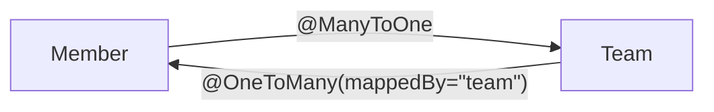
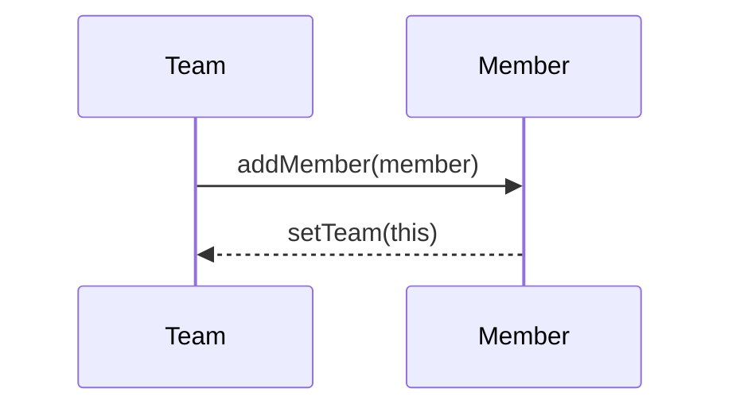
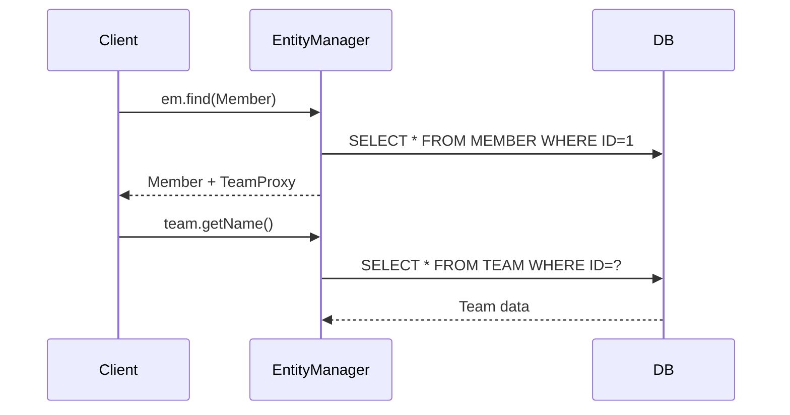
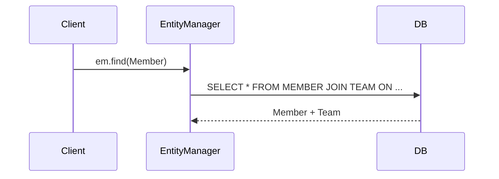

# 📚 SPRING 핵심 개념 정리(연관관계 매핑)

---
# <mark> JPA 연관관계 매핑 완전 정리 </mark>

---

## <mark>1️⃣ 연관관계 매핑이란?</mark>

> 객체 간의 관계(참조) 를 데이터베이스의 **외래키 관계와 매핑하는 것**
> 
- **객체 지향 세계**: 참조로 관계 표현 → `member.getTeam()`
- **데이터베이스 세계**: 외래 키로 관계 표현 → `MEMBER.TEAM_ID`
- **JPA 역할**: 이 둘을 자동으로 연결 (객체 그래프 ↔ 테이블 FK)

<aside>
💡

**용어정리**

**외래키 (Foreign Key ,FK)** 

다른 테이블의 기본키를 참조하는 키. “관계를 연결해주는 다리 역할”

</aside>

### 💡 사용 이유

복잡한 SQL 없이 **객체 지향적인 방식으로 데이터 조회/저장**을 가능하게 함.

---

## <mark>2️⃣ 연관관계의 종류</mark>

| 관계 | 어노테이션 | 설명 | 예시 |
| --- | --- | --- | --- |
| 다대일 | `@ManyToOne` | 여러 회원 → 한 팀 | `Member → Team` |
| 일대다 | `@OneToMany` | 한 팀 → 여러 회원 | `Team → Members` |
| 일대일 | `@OneToOne` | 회원 ↔ 프로필 | `Member ↔ Locker` |
| 다대다 | `@ManyToMany` | 학생 ↔ 강의 | `Student ↔ Subject` |

---

## <mark>3️⃣ 방향성 (Direction)</mark>

### 단방향 (Single Direction)

> 한쪽 엔티티만 상대를 참조
> 
> 
> 예: `Member`가 `Team`을 참조하지만 `Team`은 모름
> 

```java
@Entity
class Member {
    @Id @GeneratedValue
    private Long id;

    @ManyToOne
    @JoinColumn(name = "TEAM_ID")
    private Team team;
}

```

- **외래키를 가진 쪽이 연관관계의 주인**
- **연관관계의 주인만 DB 반영 가능**
- **설계가 단순하고 의존성 낮음 → 기본적으로 단방향으로 시작**

---

### 양방향 (Bidirectional)

> 양쪽 모두 서로를 참조
> 
> 
> 하지만 외래키는 여전히 **하나만 존재**
> 

```java
@Entity
class Team {
    @Id @GeneratedValue
    private Long id;

    @OneToMany(mappedBy = "team") // 읽기 전용 (주인 아님)
    private List<Member> members = new ArrayList<>();
}

@Entity
class Member {
    @Id @GeneratedValue
    private Long id;

    @ManyToOne
    @JoinColumn(name = "TEAM_ID") // 주인 (FK 가짐)
    private Team team;
}

```



- `mappedBy` : “나는 주인이 아님” → **DB에 영향 X**
- 주인(`Member.team`)만 **FK 관리 및 반영**

---

## <mark> 4️⃣ 연관관계의 주인(Owner)</mark>

> DB 외래키를 실제로 관리하는 엔티티
> 
- 주인만 `@JoinColumn` 사용 가능
- 비주인은 `mappedBy`로 표시 → 읽기 전용
- 양방향 관계 시 DB 반영은 **주인 기준**

---

## <mark> 5️⃣ 관계별 매핑 방식</mark>

### `@ManyToOne`

> 가장 일반적인 관계 (N:1)
> 

```java
@ManyToOne(fetch = FetchType.LAZY)
@JoinColumn(name = "TEAM_ID")
private Team team;

```

- 항상 **N쪽이 주인**
- **단방향/양방향 모두 가능**
- **기본 FetchType = EAGER ~~(실무에서는 LAZY 권장)~~**

---

### `@OneToMany`

> 1쪽에서 N쪽을 관리 (비추천)
> 

```java
@OneToMany(mappedBy = "team")
private List<Member> members = new ArrayList<>();

```

- 외래키가 없는 쪽이 관리 주체가 되므로 **비효율적**
- 대신 **반대편(@ManyToOne)을 주인으로 설정**하는 게 일반적
- `@JoinColumn`을 명시하지 않으면 JPA가 **중간 조인 테이블 생성**

---

### `@OneToOne`

> 1:1 관계, FK는 어느 쪽이든 가능
> 

```java
@OneToOne(fetch = FetchType.LAZY)
@JoinColumn(name = "LOCKER_ID")
private Locker locker;

```

- 접근 빈도가 높은 쪽에 FK 두는 것이 일반적

---

### `@ManyToMany`

> 중간 테이블 자동 생성 (실무 비추천)
> 

```java
@ManyToMany
@JoinTable(
    name = "STUDENT_SUBJECT",
    joinColumns = @JoinColumn(name = "STUDENT_ID"),
    inverseJoinColumns = @JoinColumn(name = "SUBJECT_ID")
)
private List<Subject> subjects = new ArrayList<>();

```

- 중간 테이블을 **자동 생성**하지만, 관리 불가 → **중간 엔티티 직접 생성** 권장

---

## <mark>6️⃣ 1:N 양방향 매핑 예시</mark>

```java
@Entity
public class Team {
    @Id @GeneratedValue
    private Long id;
    private String name;

    @OneToMany(mappedBy = "team")
    private List<Member> members = new ArrayList<>();

    public void addMember(Member member) {
        members.add(member);
        member.setTeam(this); // 양방향 동기화
    }
}

```

```java
@Entity
public class Member {
    @Id @GeneratedValue
    private Long id;
    private String name;

    @ManyToOne(fetch = FetchType.LAZY)
    @JoinColumn(name = "TEAM_ID")
    private Team team;
}

```

**연관관계의 주인 = `Member.team`**

- 외래키가 MEMBER 테이블에 존재하기 때문
- `Team.members`는 `mappedBy`로 읽기 전용

**“1:N 양방향 구조” 흐름**



→ addMember 시 내부적으로 Member.team 세팅되는 “편의 메서드” 흐름

---

## <mark>7️⃣ 로딩 전략 (Fetch Strategy)</mark>

---

### (1) 개념 이해

| 전략 | 설명 | 실행 시점 |
| --- | --- | --- |
| **EAGER** | 즉시 로딩 – 엔티티 조회 시 JOIN 수행 | `em.find()` |
| **LAZY** | 지연 로딩 – 실제 접근 시 쿼리 수행 | `member.getTeam()` |

“언제 DB에서 데이터를 가져올지”를 결정하는 전략입니다.

---

### (2) 동작 예시

**지연 로딩 (LAZY)**

```java
Member member = em.find(Member.class, 1L);
Team team = member.getTeam();   // 아직 SQL 안 나감
team.getName();                 // 이때 SQL 실행

```

**다이어그램 (지연 로딩 동작 흐름)**


    
    ## 단계별 상세 설명

<details>
<summary><strong>① <code>em.find(Member.class, 1L)</code></strong></summary>

* **Client → EntityManager**

  * 클라이언트(애플리케이션)는 `Member` 엔티티 하나를 조회 요청.
* **EntityManager → DB**

  * DB에 쿼리 실행: `SELECT * FROM MEMBER WHERE ID = 1`
* **DB → EntityManager**

  * MEMBER 데이터만 반환 (TEAM은 아직 안 가져옴)
* **EntityManager → Client**

  * 실제 `Member` 객체를 생성하고,
  * `Member.team` 필드에는 **실제 Team이 아닌 “프록시 객체(TeamProxy)”** 를 넣음.

**여기서 핵심**

> TeamProxy는 Hibernate가 내부적으로 만든 “지연 로딩용 가짜 객체”로,
> 진짜 Team 데이터는 아직 로드되지 않았어요.
> 단지 `id` 값만 알고 있는 껍데기 상태입니다.

</details>

---

<details>
<summary><strong>② <code>member.getTeam()</code></strong></summary>

* **Client → EntityManager**

  * 이제 클라이언트가 `Member`의 `team` 필드에 접근.
* 하지만 아직 프록시 상태이므로 SQL이 실행되지 않음.
  (아직 `getName()`까지 접근 안 했으니까!)

</details>

---

<details>
<summary><strong>③ <code>member.getTeam().getName()</code></strong></summary>

* `TeamProxy` 객체가 **초기화(trigger)** 됨.
* Hibernate가 프록시 내부 로직으로 DB에 쿼리를 날림:

```sql
SELECT * FROM TEAM WHERE ID = ?
```

* DB가 실제 Team 데이터를 반환 → 프록시 내부에 주입.
* 이제부터 `teamProxy`는 “진짜 Team 객체”처럼 동작.

**핵심**

> “필요한 순간에만 DB 접근” → 성능 최적화의 핵심 포인트!
> 영속성 컨텍스트가 이미 닫혀있으면 LazyInitializationException 발생

</details>

---

<details>
<summary><strong>지연 로딩 흐름 요약</strong></summary>

| 단계 | 설명                       | 실제 객체 상태              |
| -- | ------------------------ | --------------------- |
| 1  | Member 조회                | `Team`은 프록시           |
| 2  | `getTeam()` 호출           | 여전히 프록시 (DB 접근 X)     |
| 3  | `getTeam().getName()` 호출 | DB 조회 발생 → 실제 Team 로드 |

</details>

---

**즉시 로딩 (EAGER)**

```java
Member member = em.find(Member.class, 1L);

```

**다이어그램 (즉시 로딩 흐름)**



    
    ## 단계별 상세 설명
  

---

<details>
<summary><strong>① <code>em.find(Member.class, 1L)</code></strong></summary>

* **Client → EntityManager**

  * 클라이언트가 Member 조회 요청
* **EntityManager → DB**

  * Hibernate가 자동으로 JOIN 쿼리를 생성:

    ```sql
    SELECT m.*, t.*
    FROM MEMBER m
    LEFT OUTER JOIN TEAM t ON m.TEAM_ID = t.ID;
    ```
* **DB → EntityManager**

  * Member와 Team 데이터를 한 번에 모두 반환
* **EntityManager → Client**

  * 완전히 초기화된 Member 객체를 반환
    (Team은 프록시가 아님, 실제 엔티티임)

**핵심**

> 즉시 로딩은 “한 번의 JOIN으로 모든 관계 데이터를 가져오는 전략”이에요.
> 따라서 코드는 간단하지만, JOIN이 많아지면 성능이 급격히 저하될 수 있습니다.

</details>

---

<details>
<summary><strong>② 이후 코드 동작</strong></summary>

* `member.getTeam()`을 호출해도 이미 Team 데이터가 로드되어 있기 때문에
  **추가 SQL이 발생하지 않음.**

</details>

---

<details>
<summary><strong>즉시 로딩 흐름 요약</strong></summary>

| 단계 | 설명                    | 실제 객체 상태         |
| -- | --------------------- | ---------------- |
| 1  | Member 조회 시점에 JOIN 실행 | Team 즉시 로드됨      |
| 2  | `getTeam()` 호출        | 추가 SQL 없음        |
| 3  | 사용 즉시 접근 가능           | 성능은 상황에 따라 저하 가능 |

</details>

---

<details>
<summary><strong>두 전략의 핵심 차이 정리</strong></summary>

| 항목         | Lazy Loading          | Eager Loading    |
| ---------- | --------------------- | ---------------- |
| Team 필드 상태 | 프록시                   | 실제 엔티티           |
| SQL 실행 시점  | `getTeam().getName()` | `em.find()`      |
| 장점         | 필요할 때만 조회 (효율적)       | 즉시 사용 가능         |
| 단점         | 트랜잭션 종료 시 예외          | JOIN 과다, N+1 가능성 |
| 실무 권장      | 기본 설정                 | 최소 사용            |

</details>


## <mark> 8️⃣ 정리 요약표 </mark>

| 관계 | 주인 | 외래키 위치 | 기본 로딩 |
| --- | --- | --- | --- |
| `@ManyToOne` | N쪽 | N 테이블 | EAGER → LAZY |
| `@OneToMany` | One쪽 | N 테이블 | LAZY |
| `@OneToOne` | 선택 | FK 테이블 | EAGER → LAZY |
| `@ManyToMany` | 자동 | 중간 테이블 | LAZY |

---

<aside>

**용어정리**

[프록시(Proxy)]

> 지연 로딩을 가능하게 하는 ‘가짜 객체’
> 
- 실제 엔티티 대신 프록시 객체를 먼저 넣어둠
- 실제 메서드 호출 시점에 쿼리 실행 → 실제 엔티티 로드

```java
Team teamProxy = member.getTeam();
System.out.println(teamProxy.getClass());
// class com.example.Team$HibernateProxy$abc123
```

[N+1 문제]

| 상황 | 설명 |
| --- | --- |
| 1개의 쿼리로 Member 리스트 조회 | `SELECT * FROM MEMBER` |
| 각 Member마다 LAZY로 Team 조회 | Member 수(N)만큼 추가 쿼리 실행 |
| 해결법 | `fetch join`, `EntityGraph`, `BatchSize` |

💡 해결 예시:

```java
select m from Member m join fetch m.team

```

</aside>

---

### 어노테이션 정리

| 어노테이션 | 관계 | 설명 | 기본 로딩 | 주의점 |
| --- | --- | --- | --- | --- |
| `@ManyToOne` | N:1 | 가장 일반적, FK 가진 쪽이 주인 | EAGER | 실무에선 LAZY로 변경 |
| `@OneToMany` | 1:N | mappedBy로 반대편 지정 | LAZY | 주인 아님, 읽기 전용 |
| `@OneToOne` | 1:1 | FK 어느 쪽이든 가능 | EAGER | 접근 많은 쪽에 FK |
| `@ManyToMany` | N:M | 중간 테이블 자동 생성 | LAZY | 실무 비추천 |
| `@JoinColumn` | FK 지정 | 외래키 명시 | - | 반드시 작성 권장 |
| `mappedBy` | 반대편 지정 | 읽기 전용 필드 지정 | - | FK 없는 쪽에서 사용 |
| `cascade` | 영속성 전이 | 부모-자식 함께 저장/삭제 | - | 연관된 생명주기만 |
| `orphanRemoval` | 고아 객체 제거 | 부모 관계 끊기 시 자식 삭제 | - | Cascade와 함께 사용 |

---

###
